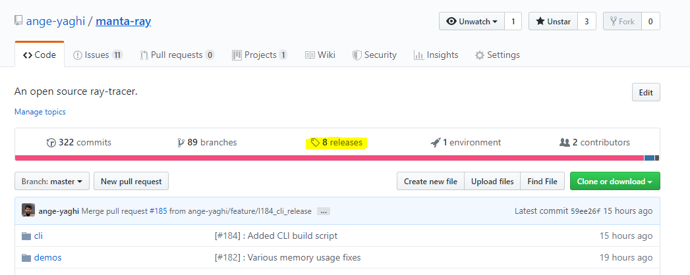
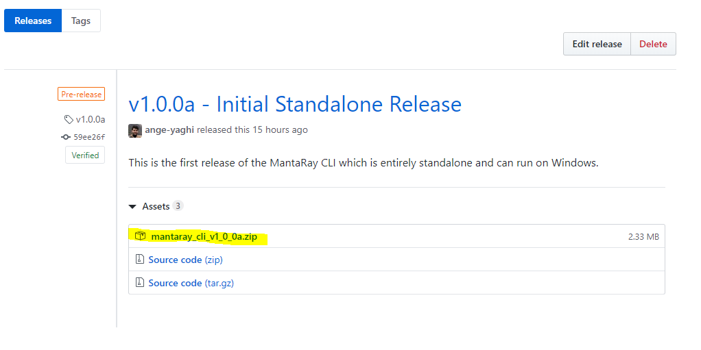
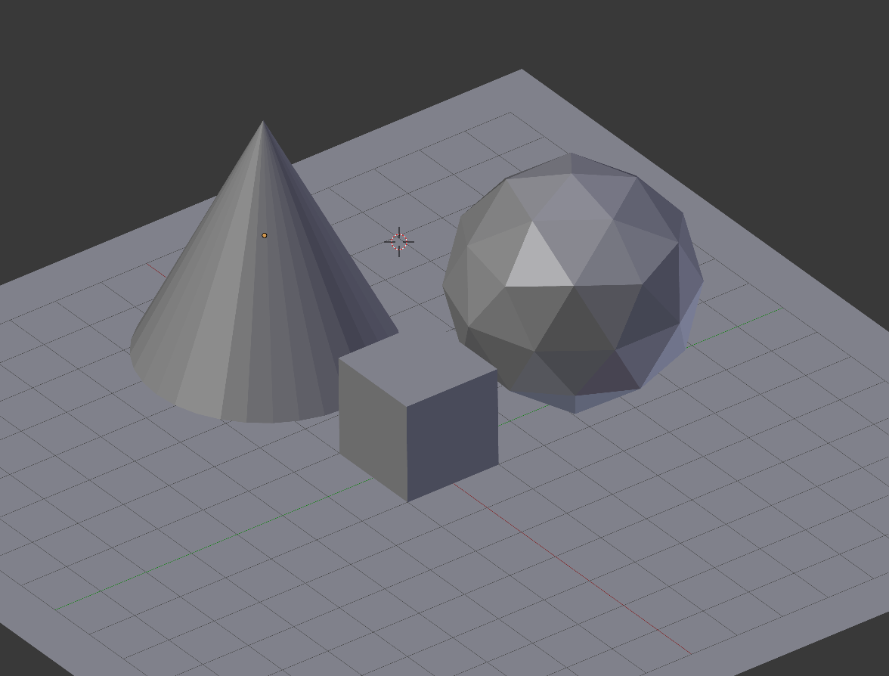
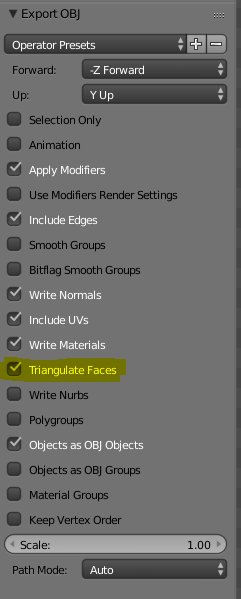
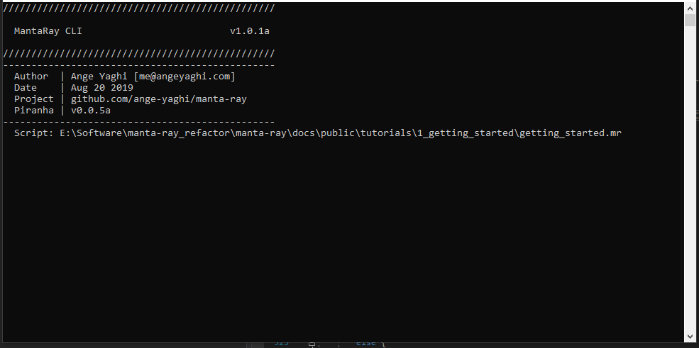
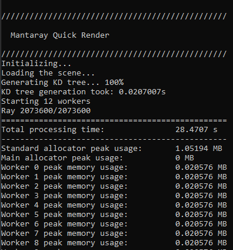
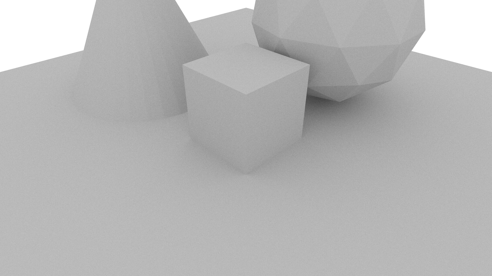

# 1 Getting Started Tutorial

This tutorial is meant for newcomers to MantaRay and will walk you through setting up your first scene using the `quick_render` node provided in the MantaRay standard library. All files for this tutorial are included in the same folder as this readme.

## Step 1 - Getting the MantaRay CLI
You have one of two options for getting the MantaRay CLI (command line interface). You could either build it yourself by cloning the MantaRay repository and building the code using Visual Studio or you could download a prebuilt release version. For this tutorial we'll use the latter approach.

First navigate to "releases":


Select the most recent version and download the zipped version:


Inside this folder you will see the executable MantaRay CLI called `mantaray_cli.exe`.

## Step 2 - Create an Empty Piranha Script

MantaRay uses Piranha as its SDL (scene description language). To create a scene, we first need to create an empty Piranha script. To get syntax highlighting, a plugin for Visual Studio Code can be downloaded [here](https://github.com/ange-yaghi/mantaray-sdl-extension).

Create a new file called `getting_started.mr` wherever you'd like to work on your computer.

## Step 3 - Import the MantaRay Standard Library

Before we can use any of MantaRay's functionality we need to import it into our script. To do this, add the following line to the top of the file:

```
import "mantaray.mr"
```

## Step 4 - Getting Our Geometry Ready

The easiest way of getting geometry into MantaRay is through a `.obj` file. In this tutorial we'll use [Blender](https://www.blender.org) which can export `.obj` files natively. 

The Blender file shown below is available in the `assets` directory of this tutorial.



We are now ready to export the file to a `.obj` file. Some precautions must be taken at this step to ensure maximum compatibility with MantaRay.



Make sure that `Triangulate Faces` is **checked** as MantaRay does not currently support non-triangular meshes. 

Now, export the geometry to the same location as `getting_started.mr` created in a previous step and call it `simple_scene.obj`. 

## Step 5 - Rendering the Scene

At the bottom of our Piranha script add the following code:

```
quick_render(
    object_file: "simple_scene.obj"
)
```

Run the MantaRay CLI by double clicking on the executable. Drag and drop `getting_started.mr` (or copy and paste the path name) into the command line interface.



After pressing enter, the renderer will begin compiling and executing the Piranha script. Render times will vary by system but shouldn't take more than a few minutes.



After rendering is complete, the results will be written to an image file in the same location as `getting_started.mr`. It will have the following format: `2019-08-20_T19_54_53_quick_render_S128.jpg`

The final render will look something like this:



## Conclusion

Congratulations, you've rendered your first scene with MantaRay! In upcoming tutorials you'll learn how to apply materials and use more advanced features of MantaRay.

## Useful Links

* [MantaRay Tutorials](../all_tutorials.md)
* [Piranha Handbook](https://github.com/ange-yaghi/piranha/blob/master/docs/handbook/handbook.md)
* [VS Code Piranha Plugin](https://github.com/ange-yaghi/mantaray-sdl-extension)
