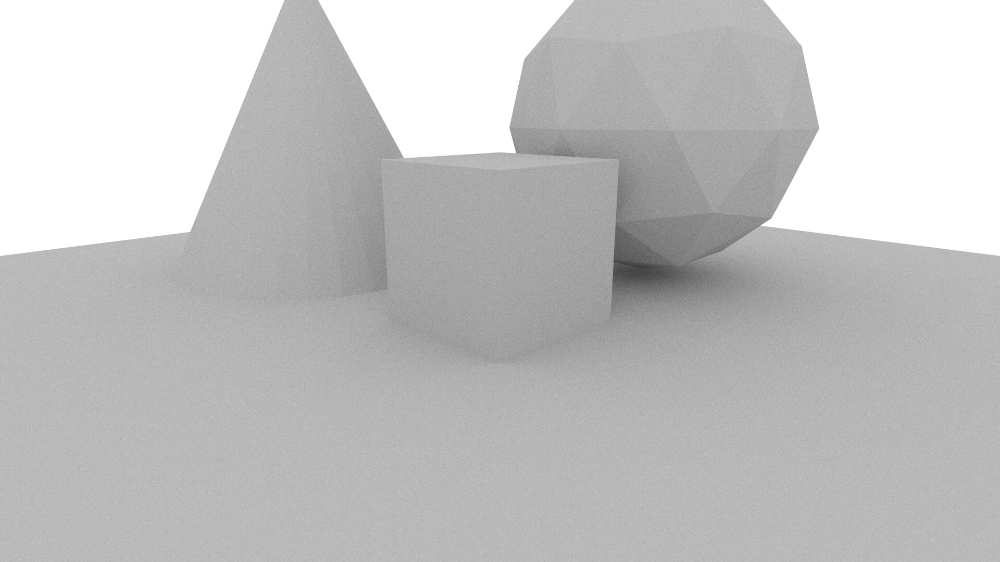
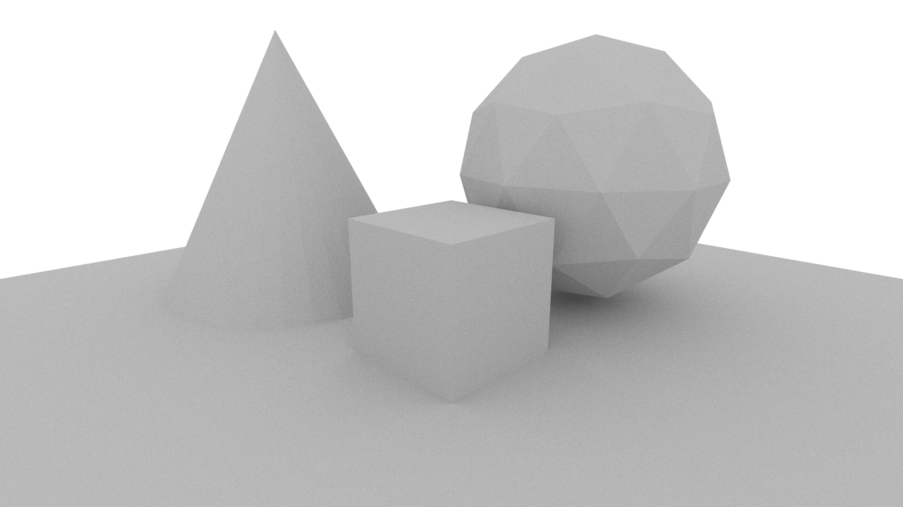
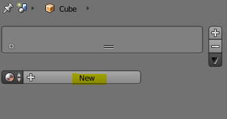

# 2 Basics of Materials

In the [previous tutorial](../1_getting_started/1_getting_started.md) we set up a simple scene using MantaRay. In this tutorial we'll explore materials and camera placement to give the scene a bit more depth.

## Step 1 - Better Camera Positioning

In the first tutorial we rendered the scene below using mostly default parameters from the `quick_render` node. 


As can be seen, the camera angle isn't particularly flattering for this scene. Fortunately, updating both the camera target and position is easy with the `quick_render` tool. To start this tutorial, let's create a copy of the script from the last tutorial and name it `adding_materials.mr`. The entire script thus far is:

```
import "mantaray.mr"

quick_render(
    object_file: "simple_scene.obj"
)
```

In Piranha, parameters are specified using the '`:`' symbol, with the name on the left and the value on the right. So far, we've only set the value of one parameter `object_file` which specifies the `.obj` file from which geometry will be loaded. The `quick_render` node has many more parameters that we can use to customize our scene. In particular `camera_target` controls the 3D location that the camera is 'looking at' and `camera_position` controls where the camera is actually positioned.

If we adjust these parameters, we will observe the scene actually change.

```
import "mantaray.mr"

quick_render(
    object_file: "simple_scene.obj",
    camera_target: vector(0.0, 0.5, 0.0),
    camera_position: vector(5.0, 2.5, 5.0)
)
```

By default, the `quick_render` node places the camera at (5.0, 5.0, 5.0) with the target at (0.0, 0.0, 0.0). By moving the `y` component of the position down by 2.5, we are also moving the camera down by 2.5 units. Similarly we have adjusted the `y` component of the `camera_target` parameter which will cause the camera to rotate upwards. Rendering this scene will produce this result:



This is okay but the top is still clipped. We can do better by shifting both the camera target and position up by 1 unit:



```
import "mantaray.mr"

quick_render(
    object_file: "simple_scene.obj",
    camera_target: vector(0.0, 1.5, 0.0),
    camera_position: vector(5.0, 3.5, 5.0)
)
```

All default parameters can be seen in `manta-lib/utilities/quick_render.mr` as the MantaRay standard library is fully accessible for viewing. **WARNING** - even though the standard library is made accessible, you should not modify it unless you *really* know what you're doing.

## Step 2 - Adding Materials in Blender

In order for MantaRay to know which material is assigned to which object, we must first set up placeholder materials in Blender. With each object selected, we can proceed to create a new material for each one.



The content of these new materials doesn't matter, but it's important to name them in a convenient way as MantaRay materials are indexed by name. For this scene, I've created 4 materials called `Floor`, `Cube`, `Sphere` and `Cone` and assigned them to their corresponding objects in the scene. Export this file in the same way that was done in the [previous tutorial](../1_getting_started/1_getting_started.md).

## Step 3 - Creating a Material Library

The 4 materials assigned to our geometric primitives don't mean much to MantaRay at this point since they are just labels. Therefore, we need to create some materials to associate with these labels. First we need to create a new empty material library. This is achieved by adding the following line of code to our SDL script:

```
material_library library()
```

We now need to fill this library with materials. We'll use the simple material node type `bsdf_material`. Each material takes the following form:

```
bsdf_material cube_material(
    library: library,
    name: "Cube", // Must match the material name in Blender
    reflectance: srgb_i(0xba, 0xdc, 0x58)
)
```

The `reflectance` parameter can be read as 'color'. `srgb_i` is a node which takes three parameters R, G and B in integer form. The components can be specified either as decimal or hexadecimal values. Using colors taken from [this website](https://flatuicolors.com/palette/au) we can now set up 4 materials for each object in the scene. The final script looks like this:

```
import "mantaray.mr"

material_library library()

bsdf_material cube_material(
    library: library,
    name: "Cube",
    reflectance: srgb_i(0xba, 0xdc, 0x58)
)

bsdf_material floor_material(
    library: library,
    name: "Floor",
    reflectance: srgb_i(0x30, 0x33, 0x6b)
)

bsdf_material cone_material(
    library: library,
    name: "Cone",
    reflectance: srgb_i(0xf9, 0xca, 0x24)
)

bsdf_material sphere_material(
    library: library,
    name: "Sphere",
    reflectance: srgb_i(0xeb, 0x4d, 0x4b)
)

quick_render(
    materials: library,
    object_file: "simple_scene.obj",
    camera_target: vector(0.0, 1.5, 0.0),
    camera_position: vector(5.0, 3.5, 5.0)
)
```

Notice how a new parameter `materials` was specified in the `quick_render` node. This lets MantaRay know which collection of materials we'll be using to apply to a scene. Executing this script in the MantaRay CLI will give something like this:


## Conclusion

Our scene now has color! It probably won't be winning any awards but it at least looks a little less bland now. In the next tutorial we'll look into using more realistic materials.

## Useful Links

* [Previous Tutorial (Getting Started)](../1_getting_started/1_getting_started.md)
* [MantaRay Tutorials](../all_tutorials.md)
* [Piranha Handbook](https://github.com/ange-yaghi/piranha/blob/master/docs/handbook/handbook.md)
* [VS Code Piranha Plugin](https://github.com/ange-yaghi/mantaray-sdl-extension)
