# 3 Realistic Materials

In the [previous tutorial](../2_basics_of_materials/2_basics_of_materials.md) we applied some simple materials to our scene to give it some color.

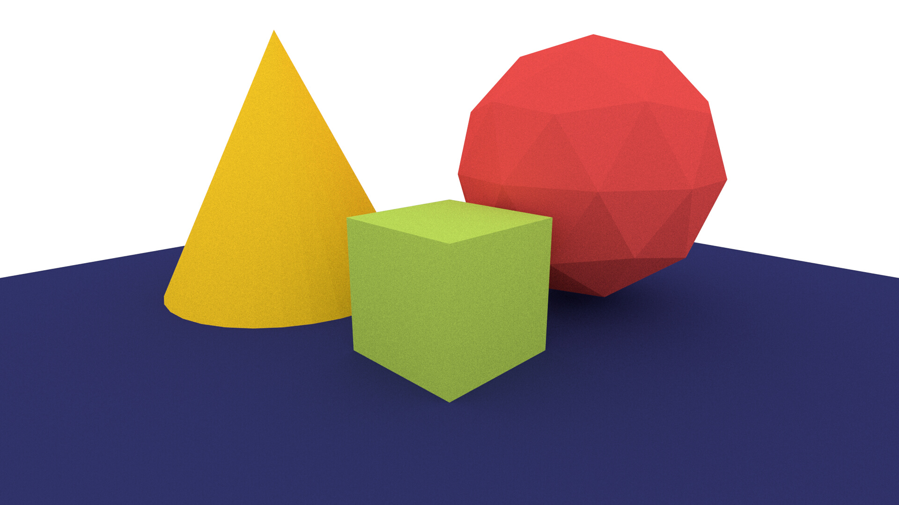

The default model used by the `bsdf_material` is the Lambertian model which is not physically realistic. It can, however, roughly approximate a highly diffuse material like paper. In this tutorial we'll look at using some of the more advanced and physically accurate models that MantaRay provides.

## Introduction to Microfacet Models

A microfacet model is an approximation to how light reflects off of a surface. It assumes that all materials are (at a microscopic level) composed of tiny reflectors. If these reflectors all point in the same direction, the material is shiny. If they are completely random and can point in any direction with equal probability, then the material would appear rough. In this tutorial we'll focus on the *GGX* model.

## Using a Microfacet Model

Recall that creating a single BSDF material looks like this:

```
bsdf_material cube_material(
    library: library,
    name: "Cube",
    reflectance: srgb_i(0xba, 0xdc, 0x58)
)
```

We purposefully omitted a parameter to the `bsdf_material` node called `bsdf`. Using this input we can decide to use a completely different reflection model. To use a GGX model, we would do the following:

```
bsdf_material cube_material(
    library: library,
    name: "Cube",
    reflectance: srgb_i(0xba, 0xdc, 0x58),
    bsdf: microfacet_brdf(
        ggx_distribution(width: 0.5)
    )
```

The GGX distribution has only one input `width`. Intuitively, `width` can be thought of as controlling the *spread* of microfacets. A smaller spread results in a shiny material, whereas a larger spread results in a rough material. The `width` can be between 0 and 1.

To test this out, make a copy of the script from tutorial 2 and name it `advanced_materials.mr`. Now update the material to use the GGX model as shown above. Three renders are shown below with different width inputs.

### width = 0.01
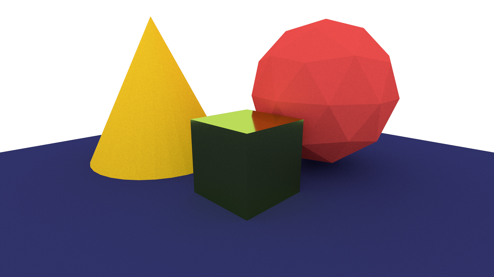

### width = 0.1
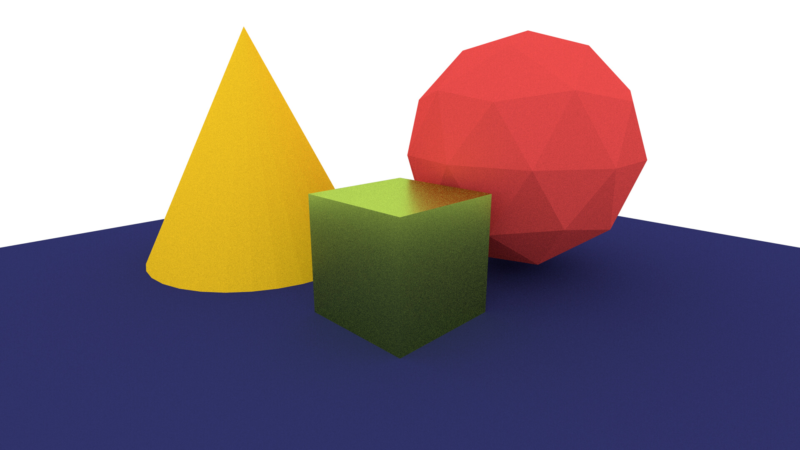

### width = 0.5
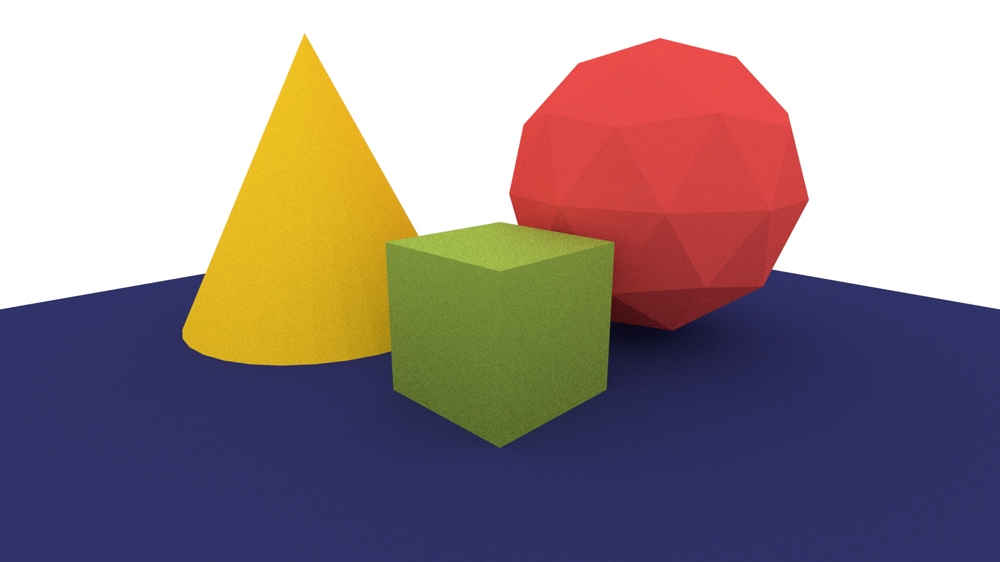

The GGX model can be applied to the other objects as done in the render below.

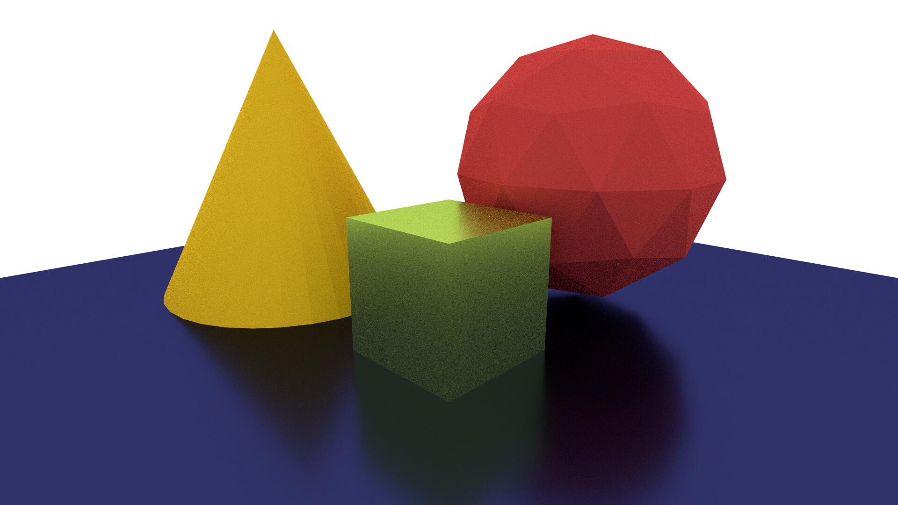

## Glass

MantaRay provides the `glass_bsdf` node to simulate glass and glass-like materials.

```
bsdf_material cube_material(
    library: library,
    name: "Cube",
    reflectance: srgb_i(0xba, 0xdc, 0x58),
    bsdf: glass_bsdf()
)
```

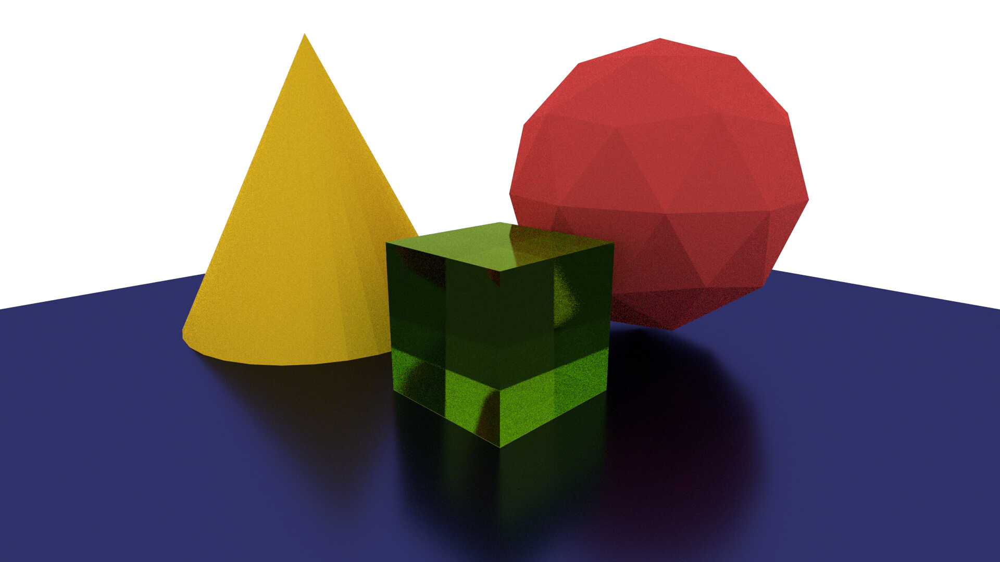

Like the `microfacet_brdf` node, a specific distribution can be specified for the glass material. We can make the glass a little less polished by passing in a GGX model with a width of 0.2.

```
bsdf_material cube_material(
    library: library,
    name: "Cube",
    reflectance: srgb_i(0xba, 0xdc, 0x58),
    bsdf: glass_bsdf(
        ggx_distribution(0.2)
    )
)
```

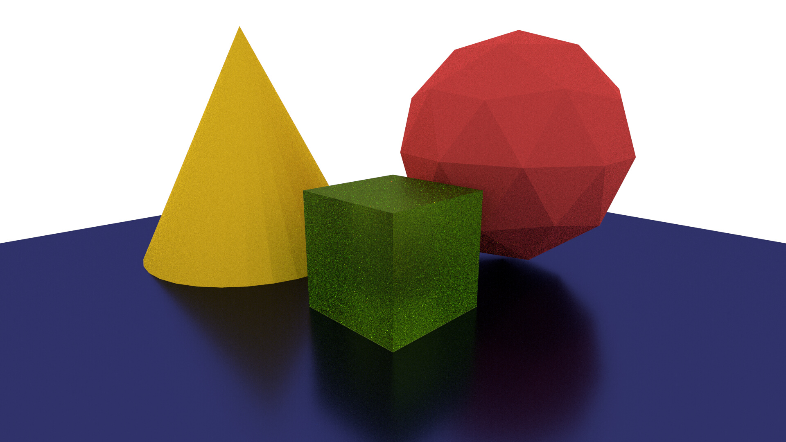

As before, the glass model can be used for artistic effect on any of the primitives in the scene.

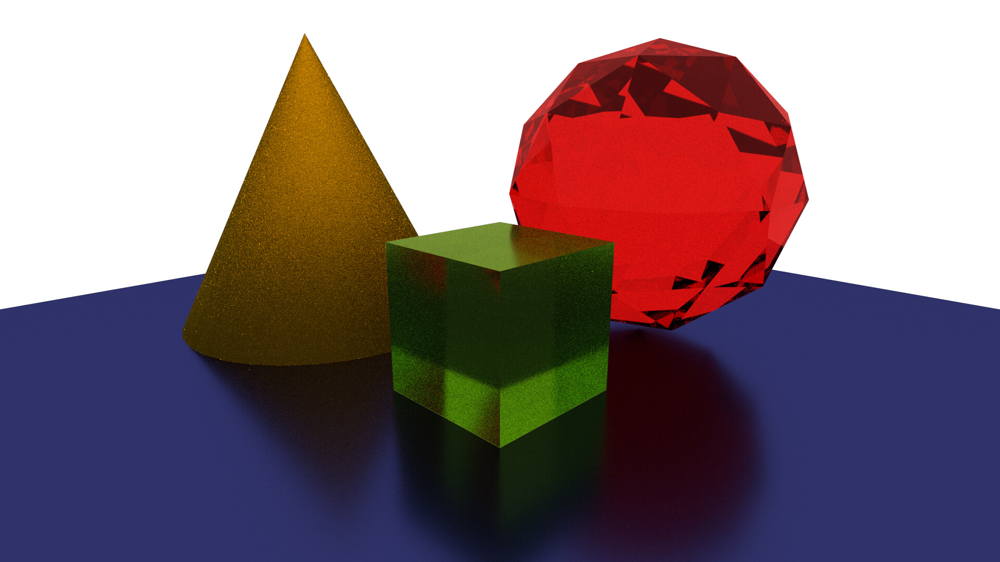

## Light Emission

Another input parameter to the `bsdf_material` is `emission` which controls how much light is emitted by an object. For example, we can make the green cube glow by using the code below:

```
bsdf_material cube_material(
    library: library,
    name: "Cube",
    reflectance:    srgb_i(0xba, 0xdc, 0x58),
    // Emits light with the same color as the reflectance
    emission:       srgb_i(0xba, 0xdc, 0x58), 
    bsdf: glass_bsdf(
        ggx_distribution(0.2)
    )
)
```

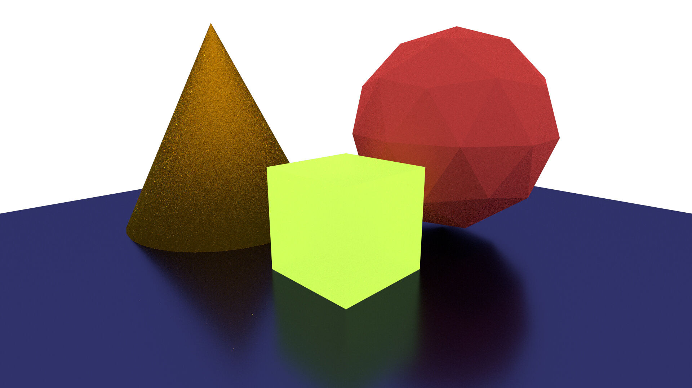

The cube is now clearly emitting light but it's a bit too bright. Since we want the color to be exactly the same as the reflectance color, we would ordinarily have to scale the R, G and B components manually by the same amount. Piranha provides a much simpler way to do this via *operations*. We can simply multiply the `srgb_i` node by 0.1 to scale the color down.

```
    ...
    emission: 0.1 * srgb_i(0xba, 0xdc, 0x58), 
    ...
```

We can now see that the cube still emits the correct shade of green light but is less bright:

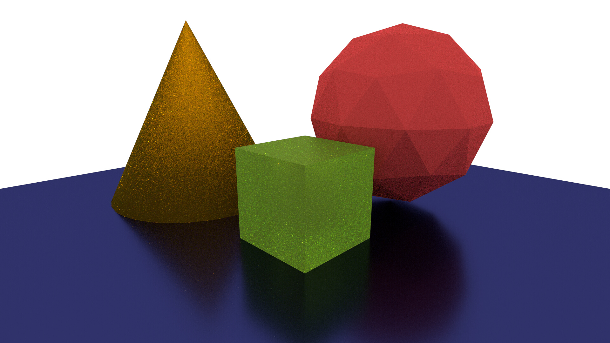

## Bilayer Material

Many materials are composed of a relatively diffuse underlying layer with a glossy coating on top. MantaRay can approximate this effect using the `bilayer_brdf` node. This BSDF is similar to the others discussed so far, but it has its own color inputs so we should remove the `reflectance` parameter from the `bsdf_material` for now. Let's use the bilayer model for the red sphere in the back to make it look a little more convincing:

```
bsdf_material sphere_material(
    library: library,
    name: "Sphere",
    bsdf: bilayer_brdf(
        coating: ggx_distribution(0.01),
        diffuse: srgb_i(0xeb, 0x4d, 0x4b),
        specular: 0.1
    )
)
```

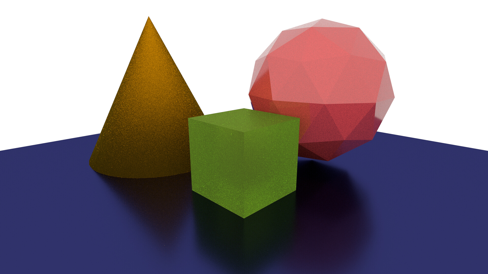

| Parameter     | Description        |
|---------------|--------------------|
|`coating`|The microfacet distribution of the coating layer|
|`diffuse`|The diffuse color of the underlying layer|
|`specular`|How reflective the surface is (between 0 and 1)|

If the specular is set to 1 then the coating layer will be highly reflective everywhere as shown in this render:

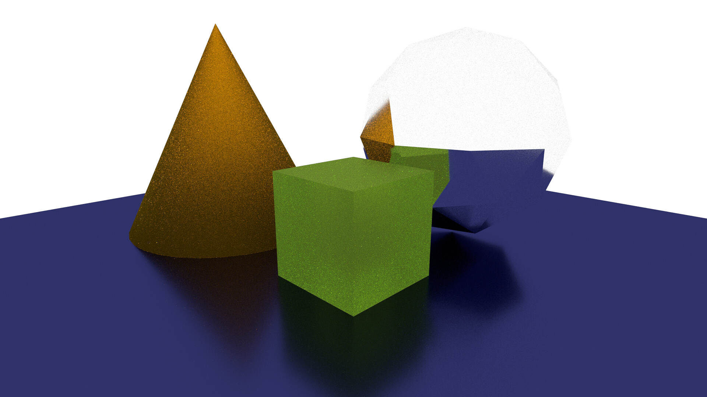

If the specular is set to 0 then the coating layer will only be reflective at very shallow angles as shown in the example below:

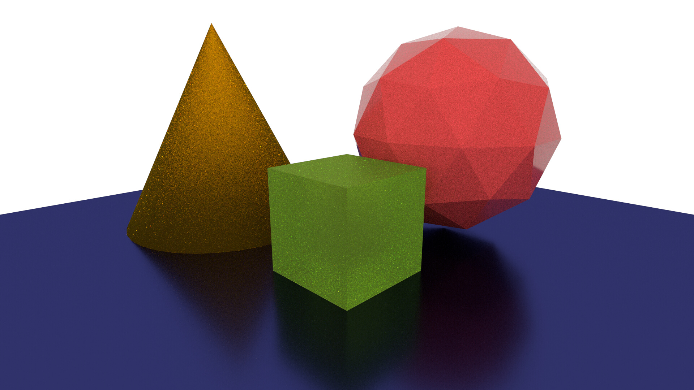

## Conclusion

We've now explored some of the more sophisticated surface models provided by MantaRay. In the next tutorial we'll look at applying textures.

* [Previous Tutorial (Basics of Materials)](../2_basics_of_materials/2_basics_of_materials.md)

## Useful Links

* [MantaRay Tutorials](../all_tutorials.md)
* [Piranha Handbook](https://github.com/ange-yaghi/piranha/blob/master/docs/handbook/handbook.md)
* [VS Code Piranha Extension](https://github.com/ange-yaghi/piranha-vscode-extension)
