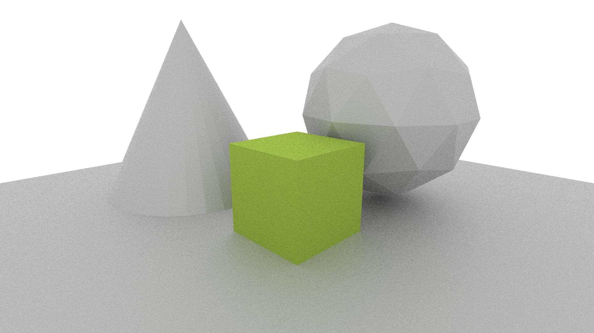
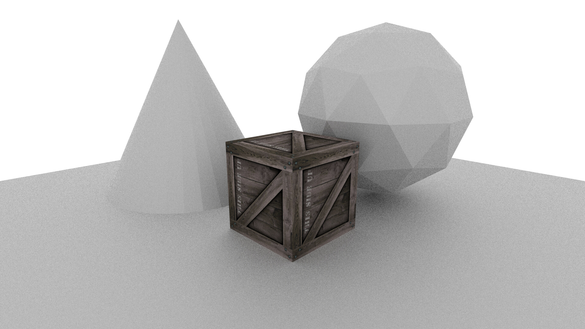
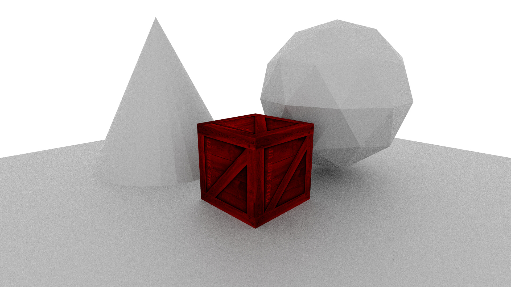
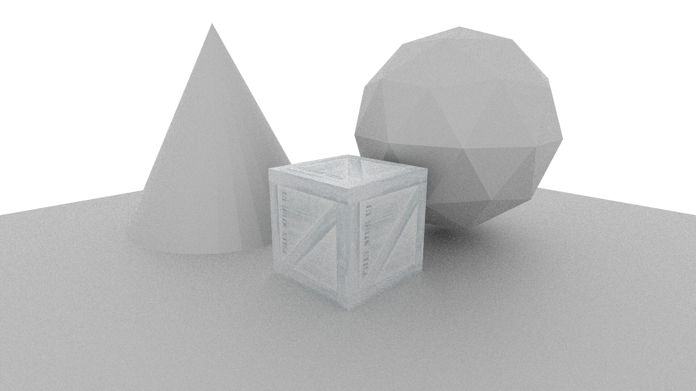

# 4 Textures

In the [previous tutorial](../3_realistic_materials/2_realistic_masterials.md) we used more advanced microfacet models to add more realism our objects.


While these models form a good basis for a realistic material, they often aren't enough to capture the complexity of a real surface. Thankfully, it's easy to apply textures to surfaces using *MantaRay*.

## Applying a Texture

Recall the template for a basic material:

```
bsdf_material cube_material(
    library: library,
    name: "Cube",
    reflectance: srgb_i(0xba, 0xdc, 0x58),
    bsdf: microfacet_brdf(
        ggx_distribution(0.5)
    )
)
```

This material would look something like this when rendered:



To map a texture onto the cube we first need to ensure that the input file contains UV texture coordinates. This would require unwrapping the mesh in a 3D editor and enabling UV coordinates when exporting the scene.

To load a texture we would add the following to our SDL file:

```
image_file crate("crate.jpg")
```

The ```image_file``` node loads a texture from a file. It takes two input parameters:

| Parameter     | Description        |
|---------------|--------------------|
|`filename`|The name of the image file to load.|
|`correct_gamma`|Whether or not to correct gamma of input data. Color data should be corrected (ie. diffuse colors, etc.). Defaults to ```true```. Can be ```true``` or ```false```.|

The newly created ```crate``` node can then be used like the ```srgb_i``` node introduced earlier. To use this texture as the color of the cube material, we could use it like this:

```
bsdf_material cube_material(
    library: library,
    name: "Cube",
    reflectance: crate,
    bsdf: microfacet_brdf(
        ggx_distribution(0.5)
    )
)
```

This will produce the following image:



As expected the crate image has become the diffuse color of the cube.

## RGBA Channels

MantaRay offers functionality for accessing individual color channels in an image. For instance, suppose that we wanted to render the image using only the red channel of the crate image, with the green and blue channels set to 0. This can easily be achieved with this syntax:

```
bsdf_material cube_material(
    library: library,
    name: "Cube",
    reflectance: vector(crate.r, 0.0, 0.0),
    bsdf: microfacet_brdf(
        ggx_distribution(0.5)
    )
)
```

As expected, only the red channel is present in the color of the cube in the rendered image:



Further manipulations like inverting an image are also possible:

```
bsdf_material cube_material(
    library: library,
    name: "Cube",
    reflectance: 1.0 - crate,
    bsdf: microfacet_brdf(
        ggx_distribution(0.5)
    )
)
```

This produces the following output:



The scalar ```1.0``` in this instance would be equivalent to ```vector(1.0, 1.0, 1.0, 1.0)``` as it's automatically expanded.

## Exporting Images

MantaRay can also be used as a basic image editor. This can be achieved using the ```image_output``` node.

| Parameter     | Description        |
|---------------|--------------------|
|`map`|The image to export.|
|`filename`|The filename of the saved image.|

A simple script that loads an image file, inverts it and then saves the output would be as follows:

```
import "mantaray.mr"

image_output(
    1.0 - image_file("crate.jpg"),
    "inverted_crate.jpg"
)
```

As can be seen, with minimal syntax and only intuitive mathematical operations, complex image manipulations can be done all in MantaRay's SDL. In later tutorials it will be shown how this can be applied to convenient post-processing of rendered images.


## Conclusion

We've now seen how textures can be manipulated and used to add detail to a 3D scene. In the next tutorial we'll look at basic image post-processing and compositing.

* [Previous Tutorial (Realistic Materials)](../3_realistic_materials/3_realistic_materials.md)

## Useful Links

* [MantaRay Tutorials](../all_tutorials.md)
* [Piranha Handbook](https://github.com/ange-yaghi/piranha/blob/master/docs/handbook/handbook.md)
* [VS Code Piranha Extension](https://github.com/ange-yaghi/piranha-vscode-extension)
